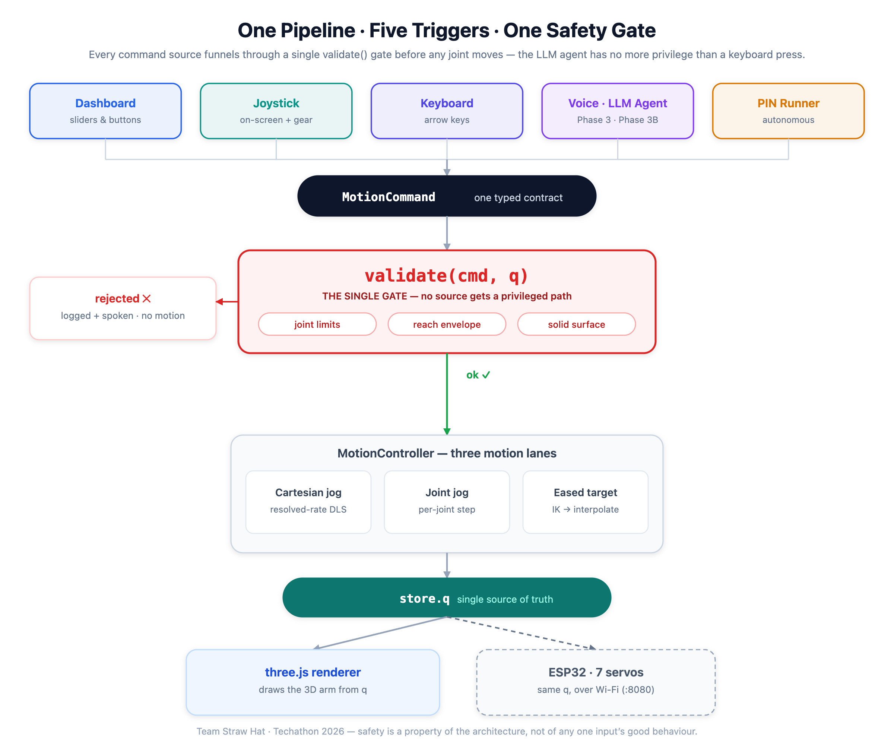
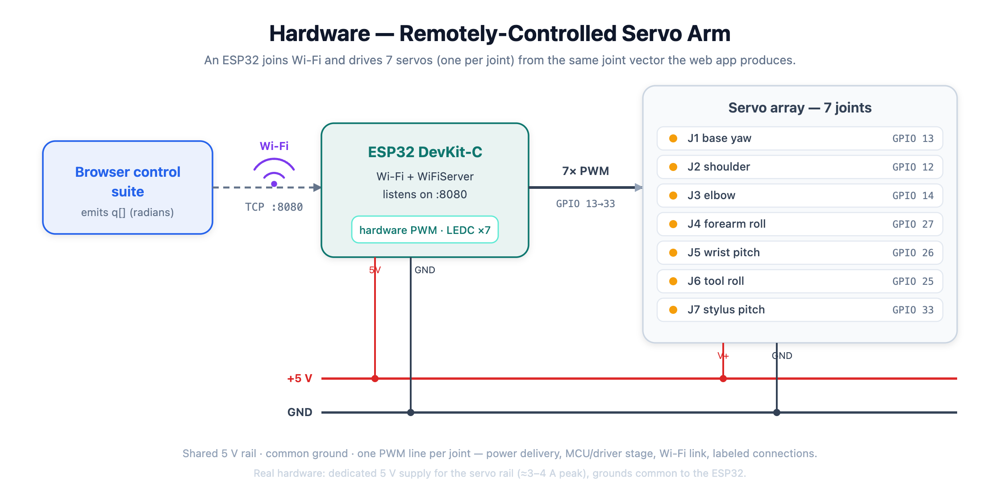
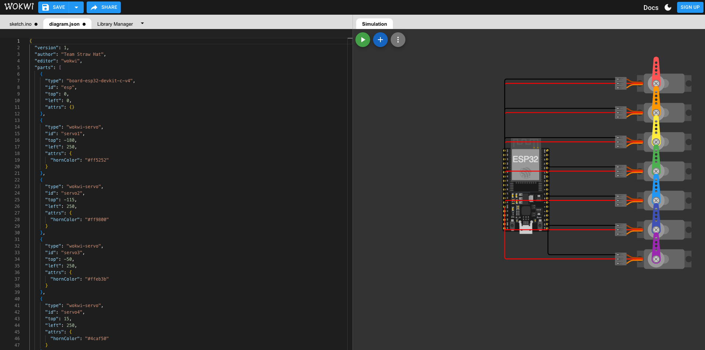

# Dry Run — Browser-Based Robotic-Arm Control Suite

**Team Straw Hat · Techathon 2026 Final Round (IUT Robotics Society)**

> 🎥 **Demo video:** _link on submission_

A 7-DOF stylus arm, simulated and driven entirely in the browser — **no hardware required, and no backend required either** (the backend below is an optional add-on, not a dependency). Five different ways to command it (dashboard, on-screen joystick, keyboard, natural-language voice, and a fully autonomous PIN-typing routine) all flow through **one motion pipeline behind one safety gate**. Nothing gets a privileged path — the LLM agent is held to the exact same limit checks as a keyboard key press.

**What's new in this round:** the original submission was intentionally fully client-side. Per faculty feedback requiring a backend + database component, this round adds an **optional** Node/Express/PostgreSQL service (`server/`) providing a **persistent event log** and **user accounts**, without changing a single line of the existing kinematics/validation/rendering core. See [Backend — persistent history & accounts](#backend--persistent-history--accounts-new) below.

---

## Highlights

- **One pipeline, five triggers.** Dashboard, joystick, keyboard, voice, and the autonomous PIN runner all emit the same typed `MotionCommand` and pass through a single `validate()` gate before any joint moves.
- **Real inverse kinematics** — a Damped Least-Squares (DLS) resolved-rate solver, Jacobian finite-difference-verified against pure-TS forward kinematics.
- **Autonomous PIN entry** — give it a 6-digit PIN and the arm plans, descends onto, and taps each key on the 3D keypad, reporting per-key accuracy in millimetres.
- **Natural-language voice** — an offline deterministic grammar handles simple commands with zero API key; an optional Groq LLM agent plans multi-step utterances. Both are limit-checked identically.
- **Safety first** — every command is bounds-checked (joint limits, reach envelope, solid surface) *before* execution; rejections are logged and spoken, never silently executed.
- **The surface is solid** — no part of the arm may pass below the table, not just the tip. A jog held into the floor **slides to contact and stops flush**, and a joint move that is legal for the joint but would bury a link is refused outright.
- **Fully client-side & verifiable** — pure-TypeScript kinematics core with **62 passing unit tests**; the FK anchor `(0, 0, 1.497 m)` is proven independently of three.js.
- **Persistent history & accounts (optional, new)** — an Express + PostgreSQL backend lets a Registered Operator create an account and have their command history survive a page reload, on top of (not instead of) the existing in-memory Event Log.

---

## Architecture — one pipeline, five triggers



<sup>Vector source: [`docs/architecture.svg`](docs/architecture.svg)</sup>

<details>
<summary>Text version of the diagram</summary>

```
  Dashboard   Joystick   Keyboard   Voice / LLM Agent   PIN Runner
      │           │          │              │                │
      └───────────┴──────────┴──────┬───────┴────────────────┘
                                     ▼
                          ┌─────────────────────┐
                          │  MotionCommand       │   one typed contract
                          │  (discriminated union)│
                          └──────────┬───────────┘
                                     ▼
                          ┌─────────────────────┐
                          │   validate(cmd, q)   │   ◄── THE SINGLE GATE
                          │  joint limits ·      │       no source bypasses it
                          │  reach envelope ·    │
                          │  solid surface       │
                          └──────────┬───────────┘
                            ok │           │ rejected
                               ▼           ▼
                     ┌──────────────┐   logged + spoken,
                     │ MotionController│   no motion
                     │  3 motion lanes │
                     └────────┬───────┘
             ┌────────────────┼────────────────┐
             ▼                ▼                ▼
     Cartesian jog       joint jog       eased target
     (resolved-rate DLS) (per-joint)     (IK → interpolate)
             └────────────────┴────────────────┘
                              ▼
                    store.q  (single source of truth)
                              ▼
                 three.js renderer follows q  →  3D arm
```

</details>

**Why this matters:** the LLM agent, the mic, and the keyboard are all *just command sources*. They cannot move a joint the validator wouldn't allow. Safety is a property of the architecture, not of any one input's good behaviour. The Event Log makes this visible — every command, validation verdict, and key-touch result lands there with a source tag.

---

## The `MotionCommand` contract

Every input produces one of these; the controller and validator only ever see this shape (`src/core/commands.ts`):

| `type` | Payload | Meaning |
|---|---|---|
| `stop` | — | E-stop: release all jogs, clear target |
| `home` | — | Go to the zero pose `(0,0,1.497 m)` |
| `rotateJoint` | `joint`, `toRad` \| `deltaRad` | Absolute or relative single-joint move |
| `jogJoint` | `joint`, `deltaRad` | Continuous joint jog step |
| `jog` | `delta: [x,y,z]` | Discrete Cartesian tip nudge (IK-solved) |
| `moveTo` | `xyz`, `tipDown?` | Move the tip to a world point via IK |
| `touchKey` | `key` | Tap a keypad key (PIN sequence) |
| `typePin` | `pin` | Autonomous multi-key PIN entry |

Sources are tagged (`dashboard` · `joystick` · `keyboard` · `voice` · `agent` · `auto`) purely for logging — they get no behavioural privilege.

---

## Inverse kinematics

The arm is a 7-joint serial chain (`base yaw → shoulder → elbow → forearm roll → wrist pitch → tool roll → stylus pitch`), transcribed directly from the provided URDF. Straight-line reach ≈ 1.187 m from the shoulder.

- **Forward kinematics** — pure per-joint `Trans · Rot`, unit-tested against the ground-truth anchor `fk(0…0) = (0, 0, 1.497 m)`.
- **Jacobian** — position Jacobian, **finite-difference-verified** against FK in the test suite.
- **Solver** — **Damped Least-Squares (DLS)**, `dq = Jᵀ(JJᵀ + λ²I)⁻¹ · e`, λ = 0.08. Damping keeps it stable through singularities (e.g. the fully-vertical home pose, which is triply-singular — only ±X is first-order reachable there; the solver correctly damps rather than blowing up). Per-frame joint-step is capped and gear-scaled so even "Turbo" stays singularity-safe.
- **Resolved-rate Cartesian jog** — the same `JJᵀ` machinery drives the joystick/arrow-key tip jog each frame, velocity-smoothed (25 ms time constant) for soft starts and sub-100 ms stops.

---

## The surface is solid

The table isn't a backdrop the arm may sink through. `src/core/floor.ts` owns one rule and every lane enforces it:

- **Whole-arm, not just the tip.** The movable arm is modelled as the polyline *joint-1 origin → … → stylus tip*. Its links are straight segments and the surface is the plane `z = 5 mm`, so the minimum height over the polyline's **vertices is exactly** the minimum over the whole arm — no sampling along links needed. (The pedestal below joint 1 is fixed structure standing *on* the surface, so it's excluded.)
- **Refused at the gate.** A `rotateJoint` can sit happily inside its joint limit and still bury a link. Driving the shoulder to its −120° limit is rejected with *"stylus tip would reach −284 mm — the surface is solid (min 5 mm)"* — before any motion.
- **Slide to contact.** A jog held into the floor doesn't freeze early or tunnel through: `clampToFloor()` bisects the per-frame step so the arm comes to rest **flush** on the plane. Browser-verified: a 4.5 s joint jog and a 5 s Cartesian tip jog both stop at exactly **5.00 mm**, and the joint jog stops at −1.83 rad — short of its −2.09 limit, because the *surface* stopped it, not the joint.
- **IK solutions are checked too.** A target point above the floor can still have an IK pose that dips a link below it, so the solved pose is re-checked before it becomes the motion target.

## Autonomous PIN entry

Give it a 6-digit PIN; a state machine (`transit → settle → pure −Z descend → dwell → retract`) taps each key:

1. Precomputed hover pose per key (a reliability net so a live IK hiccup can't strand the sequence).
2. Descend straight down onto the key top (z = 50 mm cap face).
3. Success = FK of the *executed* pose within 5 mm of the key centre → green badge with the actual mm error; red if it missed.

Browser-verified: **PIN 156 → 3/3 keys within ~1 mm.** Esc aborts mid-sequence.

---

## Voice control — two independent panels

The rulebook is explicit: *"the optional agentic extension (Phase 3B) does not replace the required deterministic voice control (Phase 3) — baselines must still work independently and will be judged as such."* So they are **two separate panels**, each with its own mic and text box. Phase 3 never calls the LLM; Phase 3B is purely additive. Both funnel through the same `validate()` gate.

### Phase 3 — deterministic voice control (required)

`src/voice/VoicePanel.tsx` + `src/voice/grammar.ts` — offline, **no API key, zero network calls**, instant. Base frame is Z-up: *forward = +X (toward the keypad) · left = +Y · up = +Z*.

| Say | Does |
|---|---|
| "home" / "reset" | Go to zero pose |
| "stop" | E-stop |
| "rotate base 30 degrees" | Absolute joint rotation (default 15° if unstated) |
| "move up 2 cm" / "down" / "left" / "forward" / "back" | Cartesian tip nudge (default 2 cm) |
| "touch key 5" | Tap a keypad key |
| "enter pin 156" | Autonomous PIN entry |

An utterance the grammar can't parse is reported as such — it is **never** silently escalated to the LLM.

### Phase 3B — agentic voice control (optional extension)

`src/voice/AgentPanel.tsx` + `src/agent/` — for multi-step / free-form phrasing ("tap key 5 twice then lift 2 cm"). Groq `openai/gpt-oss-120b` (llama-3.3-70b fallback), JSON mode, temperature 0, **zod-validated plan**.

The whole plan is dry-run through `precheck()` — the identical `validate()` gate — *before anything moves*. A rejected plan gets **one** revision round with the validator's reasons fed back; if it still fails, the agent **executes nothing** and speaks a refusal. Ambiguous instructions get a clarifying question instead of a guess. Per-command status badges show `✓` / `✗ reason` live.

TTS speaks every confirmation and rejection aloud (Web Speech API).

> The API key is entered in-browser (or via `.env.local`) and stored only in `localStorage`. It is **never committed**. Phase 3 runs entirely without it — the key only enables the Phase 3B panel.

---

## Electrical schematic (Wokwi)

A Wokwi **ESP32** drives **7 servos** (one per joint), **remotely controlled over Wi-Fi** as the brief requires. [`firmware.ino`](hardware/firmware.ino) joins Wi-Fi and serves a TCP socket on `:8080` that accepts the app's joint vector (radians, the same `q[]` the web app prints), mapping each joint onto a 0–180° servo angle using the exact limits from [`src/core/chain.ts`](src/core/chain.ts); it idle-sweeps until a pose arrives. Wiring is in [`diagram.json`](hardware/diagram.json).



<sup>Conceptual block schematic ([vector source](hardware/system-diagram.svg)). The as-wired Wokwi circuit:</sup>



The circuit covers the rubric's four elements — **power delivery** (shared 5 V rail), **microcontroller/driver stage** (ESP32 + its PWM/`ESP32Servo`), **Wi-Fi link** (ESP32 `WiFiServer`), and labeled, consistent connections. Details, power budget, and run steps in [`hardware/README.md`](hardware/README.md).

---

## Backend — persistent history & accounts (new)

Added this round on top of the existing, unmodified frontend, to satisfy the faculty requirement for a backend + database component. It is intentionally minimal and additive — two features, mapped directly onto use cases the frontend already implied but couldn't persist:

| Use case | Before | Now |
|---|---|---|
| View my saved command history | Event Log resets on every page reload | `GET /api/events` returns it back, per account |
| Manage account (register/login/logout) | N/A — every operator was a Guest Operator | `POST /api/auth/register` / `/login`, JWT sessions |

**Stack:** Node.js + Express (TypeScript) · PostgreSQL · Prisma ORM · JWT (`jsonwebtoken`) · `bcrypt`.

**Schema** (`server/prisma/schema.prisma`) — two tables:

```
users   id · name · email (unique) · passwordHash · createdAt
events  id · userId (nullable) · source · type? · message · level · createdAt
```

`events` deliberately mirrors the frontend's existing in-memory `ArmEvent` shape (`src/state/store.ts`) — it's a persistence mirror of the same "one gate, one log" stream, not a second logging contract. `userId` is nullable because Guest Operators still generate events; they're just not filed under anyone's account.

**API:**

| Method | Path | Auth | Purpose |
|---|---|---|---|
| POST | `/api/auth/register` | — | Create an account (bcrypt-hashed password) |
| POST | `/api/auth/login` | — | Exchange credentials for a JWT |
| GET | `/api/auth/me` | Bearer | Restore a session from a stored token |
| POST | `/api/events` | optional Bearer | Persist one event (guest or registered) |
| GET | `/api/events` | optional Bearer | Read back saved history for the caller, cursor-paginated (`?limit=&cursor=&level=`, returns `nextCursor`) so history beyond one page stays reachable rather than truncated |

**How it plugs into the existing app, without touching it:** `src/api/eventSync.ts` subscribes to the existing `useArmStore` from the outside and forwards new events to the API — it does not modify `useArmStore.log()` or any of the five command sources that call it. `AuthPanel` and `HistoryPanel` are new, self-contained components added to the sidebar; every existing panel, the kinematics core, `validate()`, and all 62 unit tests are untouched. If `VITE_API_BASE_URL` isn't set, both new components render nothing and the app behaves exactly as it did before this round.

**Run it (local dev):**

```bash
cd server
npm install
cp .env.example .env            # point DATABASE_URL at your Postgres instance
npx prisma migrate dev          # applies the committed migration, creates the users/events tables
npm run dev                     # http://localhost:4000
```

**Run it (production / managed Postgres):** the initial schema migration is committed at
[`server/prisma/migrations/20260723000000_init`](server/prisma/migrations/20260723000000_init/migration.sql)
— `prisma migrate dev` is a *dev-only* command that also generates new migrations from schema
drift, which typically isn't available (or wanted) against a managed database. Deploys should
run the non-interactive counterpart instead:

```bash
cd server
npm install
npm run prisma:deploy   # `prisma migrate deploy` — applies committed migrations only, no prompts
npm run build            # tsc -b
npm start                 # node dist/index.js
```

Then, in the project root:

```bash
cp .env.example .env.local
# uncomment/set: VITE_API_BASE_URL=http://localhost:4000
npm run dev
```

---

## Run locally

```bash
npm install
npm run dev        # http://localhost:5173
npm run build      # tsc -b && vite build
npx vitest run     # 62 unit tests
```

The backend has its own suite too — 29 tests covering JWT sign/verify, the
`requireAuth`/`optionalAuth` middleware, and the `/api/auth` and `/api/events`
routes against a mocked Prisma client (no live DB needed): password hashing
(never plaintext, no user-enumeration on login), guest-vs-authenticated event
attribution, and the pagination cursor logic.

```bash
cd server
npm install
npm test           # 29 tests
```

Optional (enables the agentic voice layer only):

```bash
cp .env.example .env.local   # then paste your Groq key from console.groq.com
```

The backend (accounts + persistent history) is entirely optional and off by default — see [Backend — persistent history & accounts](#backend--persistent-history--accounts-new) above to enable it.

---

## Deployment

The frontend and backend are independent deployables — deploy one without the other, or both. There's no build-time coupling between them; the only link is a URL each side is told about at runtime.

**Frontend** (static build — Vercel, Netlify, GitHub Pages, or any static host):

```bash
npm run build      # outputs dist/
```

Set `VITE_API_BASE_URL` to the deployed backend's URL as a build-time env
var on the host (not `.env.local`, which isn't available at deploy time
unless the host reads it). If it's unset, the app runs exactly as it does
without a backend at all — guest-only, no persistence, nothing breaks.

**Backend** (Node service — Render, Railway, Fly.io, or any host that runs `npm start`) + a managed Postgres instance:

```bash
npm run prisma:deploy   # applies the committed migrations, no prompts
npm run build
npm start
```

Environment variables the backend needs set on the host:

| Var | Value |
|---|---|
| `DATABASE_URL` | Connection string from your managed Postgres provider |
| `JWT_SECRET` | A long random string — **generate a fresh one for production**, don't reuse the local dev value |
| `CORS_ORIGIN` | The deployed frontend's origin — see below |
| `PORT` | Usually set automatically by the host; only set manually if it isn't |

**Connecting the two — `CORS_ORIGIN` is the part most likely to get missed.** It defaults to `http://localhost:5173` (the local dev server) only. Once the frontend has a real deployed URL, the backend needs to be told to allow it too, or every request will fail CORS with no useful error client-side beyond "Failed to fetch":

```
CORS_ORIGIN=http://localhost:5173,https://your-deployed-frontend.example.com
```

It's comma-separated, so local dev and the deployed frontend can both be listed at once — you don't have to choose.

---

## Tech stack & attribution

**Frontend:** React 19 · Vite · TypeScript (strict) · Tailwind CSS · **three.js** (MIT) · **urdf-loader** by gkjohnson (MIT) · zustand · zod · Web Speech API · Groq API · Wokwi. Provided assets: `stylus_arm.urdf`, `key.config.json`.

**Backend (new):** Node.js · Express · TypeScript · PostgreSQL · Prisma ORM · `jsonwebtoken` · `bcrypt`.

All application code was written from scratch (no pre-written code reuse, per the rulebook). The backend added this round follows the same principle.

---

## Project Status

All Phase 1-5 requirements completed, including the agentic AI layer and persistent backend.

## Team Straw Hat

| Member | Lane |
|---|---|
| Meherab (meherabhossainmmh-lang) — **team lead** | Overall architecture · frontend↔backend integration · event-sync wiring · README/docs · release |
| oishesalma | Backend: accounts & authentication (`server/src/routes/auth.ts`, JWT/bcrypt) · `AuthPanel` |
| akterjobaida57-debug | Backend: persistent event log (`server/src/routes/events.ts`, Prisma schema) · `HistoryPanel` |
| _(4th member — joining soon)_ | Reserved: event-log filtering/pagination UI, once added to the repo |

---

## Challenges & future scope

- **Singularity handling** — the vertical home pose is triply-singular; DLS damping keeps the solver honest instead of exploding, and the UI badges "near reach limit" truthfully rather than faking motion.
- **One gate, many inputs** — the hardest and most valuable design choice was refusing to give any source (especially the LLM) a fast path around `validate()`.
- **Keeping the backend additive** — the constraint we held ourselves to this round: no existing file's *behaviour* changes when the backend is absent. `eventSync.ts` observes the store from the outside rather than editing `log()`, and both new panels early-return to `null` when `VITE_API_BASE_URL` is unset.
- **Next:** orientation-aware (full 6-DOF pose) IK targets, trajectory preview before execution, closing the loop to the Wokwi firmware over serial, pagination/filtering on saved history (planned for the 4th team member), and role-based access if multi-operator review becomes a requirement.

// activity 1784722020.0 0.3223945004015777
// activity 1784867460.0 0.07983310070878014
// activity 1784883000.0 0.9863379298168519
// activity 1784938020.0 0.1020794253641999
// activity 1784953440.0 0.3086397656773703
// activity 1785012420.0 0.03245411196722603
// activity 1785025800.0 0.1255217840912607
// activity 1785055440.0 0.7273595623581831
// activity 1785084900.0 0.9028626168417542
// activity 1785170100.0 0.07463148945989728
// activity 1785184260.0 0.7541753531612557
// activity 1785257220.0 0.22471004953466567
// activity 1785270960.0 0.7051835121668666
// activity 1785300540.0 0.06120597032838593
// activity 1785312180.0 0.39745065684266623
// activity 1785441840.0 0.08524742927318285
// activity 1785487380.0 0.8061254225178714
// activity 1785629880.0 0.24841613952682617
<!-- 1783247280.0 0.921775012241705 -->
<!-- 1783268160.0 0.8809845897753795 -->
<!-- 1783290120.0 0.9440742895905069 -->
<!-- 1783311420.0 0.0799108556862358 -->
<!-- 1783333620.0 0.656770456436926 -->
<!-- 1783355340.0 0.542692067951964 -->
<!-- 1783378080.0 0.6197543604068986 -->
<!-- 1783399020.0 0.9607165957027841 -->
<!-- 1783420020.0 0.27125069268795665 -->
<!-- 1783441200.0 0.30497505496384436 -->
<!-- 1783464360.0 0.9247262645157992 -->
<!-- 1783483380.0 0.3745399132480016 -->
<!-- 1783505340.0 0.6157433782399074 -->
<!-- 1783528140.0 0.8284558939761928 -->
<!-- 1783550520.0 0.3253078188513997 -->
<!-- 1783570560.0 0.34488890091959046 -->
<!-- 1783594620.0 0.4049216458986332 -->
<!-- 1783613100.0 0.988738241384738 -->
<!-- 1783635120.0 0.09402829944737556 -->
<!-- 1783658160.0 0.1996533902711073 -->
<!-- 1783679100.0 0.21332817798569126 -->
<!-- 1783700220.0 0.15736958531067968 -->
<!-- 1783723440.0 0.1687511766167774 -->
<!-- 1783742700.0 0.949304872682988 -->
<!-- 1783764660.0 0.8374331159223333 -->
<!-- 1783788900.0 0.16434666688711952 -->
<!-- 1783809900.0 0.19865048771431348 -->
<!-- 1783829280.0 0.11117273852649057 -->
<!-- 1783852020.0 0.6123817505198627 -->
<!-- 1783873500.0 0.9678546673014918 -->
<!-- 1783894800.0 0.46054650327952695 -->
<!-- 1783917840.0 0.5551092897365215 -->
<!-- 1783937340.0 0.16132672724248054 -->
<!-- 1783960020.0 0.5201368539398918 -->
<!-- 1783983240.0 0.7577343454999563 -->
<!-- 1784003340.0 0.11735312039529289 -->
<!-- 1784024700.0 0.5200671770073498 -->
<!-- 1784046000.0 0.578419816580891 -->
<!-- 1784068680.0 0.10820987839276253 -->
<!-- 1784090640.0 0.8178290148303504 -->
<!-- 1784112480.0 0.544409446445846 -->
<!-- 1784134200.0 0.2472691757021006 -->
<!-- 1784154540.0 0.844318872667111 -->
<!-- 1784177700.0 0.8778151170841736 -->
<!-- 1784197980.0 0.3321692099630893 -->
<!-- 1784220540.0 0.4184379374570085 -->
<!-- 1784241180.0 0.48385144639623157 -->
<!-- 1784263140.0 0.6323935566964934 -->
<!-- 1784284320.0 0.024656837231784134 -->
<!-- 1784304000.0 0.7108093581053151 -->
<!-- 1784328000.0 0.04157179575199099 -->
<!-- 1784347500.0 0.3984346935872932 -->
<!-- 1784372160.0 0.19068925049301644 -->
<!-- 1784392980.0 0.1341175161586905 -->
<!-- 1784412540.0 0.23196042005234707 -->
<!-- 1784434680.0 0.2724341776976713 -->
<!-- 1784457780.0 0.34502574901361194 -->
<!-- 1784480280.0 0.9033427587741845 -->
<!-- 1784498880.0 0.2813815668026617 -->
<!-- 1784521920.0 0.7162532769472365 -->
<!-- 1784542020.0 0.003839050832396107 -->
<!-- 1784565300.0 0.84615982531009 -->
<!-- 1784588340.0 0.6948826897133152 -->
<!-- 1784607720.0 0.30093214476700736 -->
<!-- 1784629440.0 0.37401570679563023 -->
<!-- 1784652300.0 0.2992964668627417 -->
<!-- 1784674560.0 0.9392977771008826 -->
<!-- 1784696220.0 0.2252994943500144 -->
<!-- 1784715420.0 0.2943798380889304 -->
<!-- 1784739180.0 0.97179923165694 -->
<!-- 1784760600.0 0.8785558312173183 -->
<!-- 1784779260.0 0.5000742635376272 -->
<!-- 1784801460.0 0.299227737762362 -->
<!-- 1784825760.0 0.19470538759094425 -->
<!-- 1784844840.0 0.5239422025151476 -->
<!-- 1784866320.0 0.5975119022739099 -->
<!-- 1784889300.0 0.884099873618519 -->
<!-- 1784910060.0 0.8702949216853663 -->
<!-- 1784932800.0 0.5290799134383101 -->
<!-- 1784954700.0 0.3350970637946571 -->
<!-- 1784973780.0 0.1033446187242072 -->
<!-- 1784997780.0 0.5007463752978627 -->
<!-- 1785019500.0 0.8810592489542738 -->
<!-- 1785041820.0 0.6904002361327787 -->
<!-- 1785063300.0 0.5681139630734424 -->
<!-- 1785084240.0 0.04057405379323942 -->
<!-- 1785104400.0 0.165529931028234 -->
<!-- 1785127260.0 0.32744400787301564 -->
<!-- 1785148020.0 0.7277161465478562 -->
<!-- 1785168480.0 0.27949582722497146 -->
<!-- 1785190920.0 0.36637553749622187 -->
<!-- 1785212640.0 0.4332258120300939 -->
<!-- 1785233220.0 0.4595473704485358 -->
<!-- 1785256560.0 0.19793379238572706 -->
<!-- 1785278700.0 0.43282630777288544 -->
<!-- 1785298380.0 0.0027129331041032545 -->
<!-- 1785321600.0 0.04615197299888296 -->
<!-- 1785341400.0 0.8980444717379873 -->
<!-- 1785365040.0 0.3449547972261904 -->
<!-- 1785385740.0 0.45817025897481245 -->
<!-- 1785407580.0 0.07343507721988507 -->
<!-- 1785428760.0 0.8833934235514727 -->
<!-- 1785448860.0 0.7456747011647882 -->
<!-- 1785472680.0 0.5557845980994007 -->
<!-- 1785493020.0 0.9709426471628956 -->
<!-- 1785514200.0 0.5704216469712634 -->
<!-- 1785535860.0 0.8738116580825058 -->
<!-- 1785559380.0 0.5904013360890799 -->
<!-- 1785578580.0 0.2435018883123392 -->
<!-- 1785600360.0 0.4091000755807854 -->
<!-- 1785624180.0 0.882275048333515 -->
<!-- 1785645060.0 0.6486416334800867 -->
<!-- 1785664980.0 0.3218080649091858 -->
<!-- 1785689940.0 0.39831943592698016 -->
<!-- 1785709920.0 0.3044758448531546 -->
<!-- 1785732240.0 0.12143342671747226 -->
<!-- 1785753120.0 0.9356269321933776 -->
<!-- 1785772980.0 0.6282565939350045 -->
<!-- 1785796680.0 0.0636258699521185 -->
<!-- 1785819060.0 0.559547245034418 -->
<!-- 1785840120.0 0.6414197756021494 -->
<!-- 1785859920.0 0.3601751705835845 -->
<!-- 1785883860.0 0.5440759381232324 -->
<!-- 1785905820.0 0.7216543731010319 -->
<!-- 1785927180.0 0.5317219762639747 -->
<!-- 1785948300.0 0.23698373694441077 -->
<!-- 1785970620.0 0.06388223162263895 -->
<!-- 1785991740.0 0.32477503171406297 -->
<!-- 1786013040.0 0.4157353789474887 -->
<!-- 1786035420.0 0.3188826651640053 -->
<!-- 1786057080.0 0.7153700808809408 -->
<!-- 1786078500.0 0.950104908940277 -->
<!-- 1786098900.0 0.3775518739817276 -->
<!-- 1786119960.0 0.8489575819650476 -->
<!-- 1786142040.0 0.5767233078104813 -->
<!-- 1786164960.0 0.7388111404281791 -->
<!-- 1786184280.0 0.44210327126083016 -->
<!-- 1786206120.0 0.9681888888530811 -->
<!-- 1786228320.0 0.3846333200014982 -->
<!-- 1786251300.0 0.7229090403436842 -->
<!-- 1786270200.0 0.7332753833967188 -->
<!-- 1786291980.0 0.5496705646587295 -->
<!-- 1786315260.0 0.874238668216332 -->
<!-- 1786336920.0 0.18544688571195744 -->
<!-- 1786356420.0 0.7028945266599738 -->
<!-- 1786380120.0 0.6454885636534321 -->
<!-- 1786400760.0 0.043088385634480364 -->
<!-- 1786423680.0 0.14941252148514228 -->
<!-- 1786443420.0 0.5981280401436099 -->
<!-- 1786467240.0 0.933028269506568 -->
<!-- 1786489140.0 0.2090275218544808 -->
<!-- 1786509780.0 0.01978303580564056 -->
<!-- 1786532340.0 0.709496481063229 -->
<!-- 1786550400.0 0.8949276907440502 -->
<!-- 1786575060.0 0.7343067449379399 -->
<!-- 1786593720.0 0.13100497777834208 -->
<!-- 1786617960.0 0.0411921552636616 -->
<!-- 1786636980.0 0.0720764892987854 -->
<!-- 1786660200.0 0.26765421102554 -->
<!-- 1786681500.0 0.0005565937312808078 -->
<!-- 1786704780.0 0.38111456944100186 -->
<!-- 1786726140.0 0.6503607797816322 -->
<!-- 1786745940.0 0.38209035201831776 -->
<!-- 1786767300.0 0.3976237055075327 -->
<!-- 1786790100.0 0.39875803465720905 -->
<!-- 1786812240.0 0.7880848490154242 -->
<!-- 1786832040.0 0.6783587902984858 -->
<!-- 1786854960.0 0.8420774963420739 -->
<!-- 1786875720.0 0.4762201662002459 -->
<!-- 1786897320.0 0.22432921018307528 -->
<!-- 1786921020.0 0.28126904289717525 -->
<!-- 1786942740.0 0.2236647745934155 -->
<!-- 1786963800.0 0.4166462751628559 -->
<!-- 1786983540.0 0.12396949358720566 -->
<!-- 1787006940.0 0.4786345998207826 -->
<!-- 1787028840.0 0.8780861880470813 -->
<!-- 1787049420.0 0.8803365566311964 -->
<!-- 1787072280.0 0.9588725569772695 -->
<!-- 1787091900.0 0.037512411745501684 -->
<!-- 1787112060.0 0.14361309170879621 -->
<!-- 1787136960.0 0.43014594415360885 -->
<!-- 1787156460.0 0.39877157153396103 -->
<!-- 1787179440.0 0.8981873429077791 -->
<!-- 1787201820.0 0.17640169717140597 -->
<!-- 1787222400.0 0.05837795122257694 -->
<!-- 1787243280.0 0.25386041675732873 -->
<!-- 1787264580.0 0.10618147484497231 -->
<!-- 1787286300.0 0.9363346667593418 -->
<!-- 1787307840.0 0.08215956042808925 -->
<!-- 1787328720.0 0.27343388769625765 -->
<!-- update 1783684800.0 0.9472631171478348 -->
<!-- update 1783710000.0 0.5676841283448637 -->
<!-- update 1783735200.0 0.1386157276434592 -->
<!-- update 1783742400.0 0.8204185088274707 -->
<!-- update 1783749600.0 0.40802259417536324 -->
<!-- update 1783756800.0 0.5617878121668106 -->
<!-- update 1783778400.0 0.6060838213848062 -->
<!-- update 1783796400.0 0.654374846510774 -->
<!-- update 1783825200.0 0.42901273340681945 -->
<!-- update 1783843200.0 0.8676464796576977 -->
<!-- update 1783868400.0 0.700076428358617 -->
<!-- update 1783879200.0 0.31788245264391524 -->
<!-- update 1783904400.0 0.5849562016358854 -->
<!-- update 1783926000.0 0.4751183767499735 -->
<!-- update 1783933200.0 0.4174383633922186 -->
<!-- update 1783940400.0 0.3960634628792218 -->
<!-- update 1783954800.0 0.9768272518151182 -->
<!-- update 1783962000.0 0.48629692506752986 -->
<!-- update 1783972800.0 0.06717391486002422 -->
<!-- update 1784001600.0 0.626823307066498 -->
<!-- update 1784012400.0 0.08776656053907794 -->
<!-- update 1784041200.0 0.5684472961863217 -->
<!-- update 1784059200.0 0.06589775725254465 -->
<!-- update 1784080800.0 0.8302877725361898 -->
<!-- update 1784095200.0 0.0754828622935243 -->
<!-- update 1784116800.0 0.02635244655070923 -->
<!-- update 1784142000.0 0.6017246261364719 -->
<!-- update 1784163600.0 0.998910819906667 -->
<!-- update 1784192400.0 0.296529149321337 -->
<!-- update 1784221200.0 0.09093271640958656 -->
<!-- update 1784232000.0 0.7808441687675377 -->
<!-- update 1784242800.0 0.6631568716404738 -->
<!-- update 1784260800.0 0.7094263857573105 -->
<!-- update 1784275200.0 0.854224716193491 -->
<!-- update 1784286000.0 0.5616404882934045 -->
<!-- update 1784307600.0 0.43384267620162986 -->
<!-- update 1784336400.0 0.8693144196591864 -->
<!-- update 1784354400.0 0.7441331958108066 -->
<!-- update 1784383200.0 0.09486379851069926 -->
<!-- update 1784401200.0 0.7204784045890612 -->
<!-- update 1784422800.0 0.8561959480517113 -->
<!-- update 1784448000.0 0.9793615808700559 -->
<!-- update 1784476800.0 0.528597101279081 -->
<!-- update 1784505600.0 0.8474524293929852 -->
<!-- update 1784512800.0 0.4877201805884175 -->
<!-- update 1784523600.0 0.490084671705843 -->
<!-- update 1784552400.0 0.7738880847750725 -->
<!-- update 1784570400.0 0.5512586960488683 -->
<!-- update 1784581200.0 0.5556197030970351 -->
<!-- update 1784606400.0 0.6768959633598205 -->
<!-- update 1784631600.0 0.32130945564719027 -->
<!-- update 1784649600.0 0.01696391558593091 -->
<!-- update 1784656800.0 0.1627834765216999 -->
<!-- update 1784682000.0 0.8495813748122861 -->
<!-- update 1784700000.0 0.671552784927138 -->
<!-- update 1784721600.0 0.24593811196016968 -->
<!-- update 1784746800.0 0.5003520667949024 -->
<!-- update 1784772000.0 0.5221201026206677 -->
<!-- update 1784786400.0 0.5489653047973881 -->
<!-- update 1784804400.0 0.6999304557106618 -->
<!-- update 1784833200.0 0.3130434528688306 -->
<!-- update 1784847600.0 0.7765945910778073 -->
<!-- update 1784876400.0 0.2069150615170141 -->
<!-- update 1784898000.0 0.27439268853425214 -->
<!-- update 1784923200.0 0.6933450803876633 -->
<!-- update 1784952000.0 0.5963870873926551 -->
<!-- update 1784962800.0 0.04877282667284877 -->
<!-- update 1784988000.0 0.06346568100601069 -->
<!-- update 1784998800.0 0.4062243191896263 -->
<!-- update 1785016800.0 0.798466294253598 -->
<!-- update 1785027600.0 0.2843474899191295 -->
<!-- update 1785038400.0 0.43088816980536726 -->
<!-- update 1785067200.0 0.06363960329100382 -->
<!-- update 1785088800.0 0.734714205455222 -->
<!-- update 1785110400.0 0.7325863253411304 -->
<!-- update 1785124800.0 0.6726589840746392 -->
<!-- update 1785132000.0 0.41001172206172365 -->
<!-- update 1785157200.0 0.016949307432551186 -->
<!-- update 1785164400.0 0.6301864466881892 -->
<!-- update 1785186000.0 0.8021774165247523 -->
<!-- update 1785193200.0 0.4024750639256601 -->
<!-- update 1785200400.0 0.3795570773841761 -->
<!-- update 1785218400.0 0.5180259502873281 -->
<!-- update 1785232800.0 0.9135374611495403 -->
<!-- update 1785240000.0 0.43452033336868945 -->
<!-- update 1785268800.0 0.13334387344125698 -->
<!-- update 1785290400.0 0.1624602924072006 -->
<!-- update 1785304800.0 0.8431329484505871 -->
<!-- update 1785330000.0 0.6348602950982642 -->
<!-- update 1785358800.0 0.17340636640678664 -->
<!-- update 1785373200.0 0.5228960246271678 -->
<!-- update 1785384000.0 0.8647951636320551 -->
<!-- update 1785398400.0 0.7590969246393959 -->
<!-- update 1785412800.0 0.9095789828868418 -->
<!-- update 1785438000.0 0.18861358347420853 -->
<!-- update 1785452400.0 0.22183490194398958 -->
<!-- update 1785481200.0 0.3722945041863659 -->
<!-- update 1785488400.0 0.7831837764838862 -->
<!-- update 1785506400.0 0.38583490136534715 -->
<!-- update 1785513600.0 0.5539527753489839 -->
<!-- update 1785542400.0 0.6693912537424583 -->
<!-- update 1785560400.0 0.9962921859266465 -->
<!-- update 1785589200.0 0.561566407433624 -->
<!-- update 1785596400.0 0.8224799851064327 -->
<!-- update 1785621600.0 0.9482004681709815 -->
<!-- update 1785639600.0 0.9477703663552485 -->
<!-- update 1785657600.0 0.9803355157473795 -->
<!-- update 1785668400.0 0.9267566062229887 -->
<!-- update 1785679200.0 0.2823923960389082 -->
<!-- update 1785686400.0 0.8247900228606737 -->
<!-- update 1785700800.0 0.42787043541426784 -->
<!-- update 1785711600.0 0.5674668313693708 -->
<!-- update 1785726000.0 0.7159258779568286 -->
<!-- update 1785733200.0 0.4480970695222144 -->
<!-- update 1785740400.0 0.04273927642457809 -->
<!-- update 1785754800.0 0.09587436995627496 -->
<!-- update 1785772800.0 0.690356546904931 -->
<!-- update 1785794400.0 0.3496463839871048 -->
<!-- update 1785819600.0 0.09462795360813625 -->
<!-- update 1785834000.0 0.8661288342747494 -->
<!-- update 1785862800.0 0.3287991862367793 -->